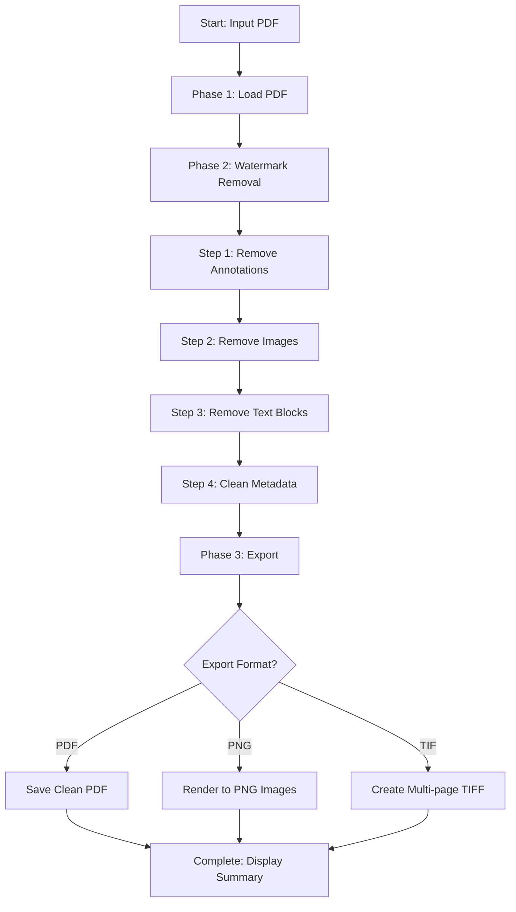
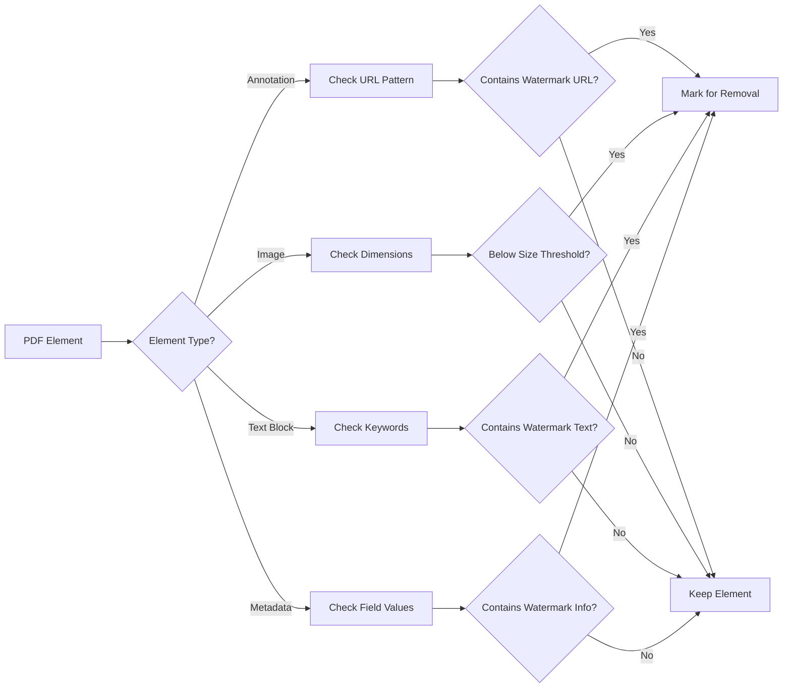

# xsukax CamScanner PDF Watermark Remover

[](https://www.python.org/downloads/)
[](https://www.gnu.org/licenses/gpl-3.0)
[](https://github.com/xsukax/xsukax-CamScanner-PDF-Watermark-Remover)
[](https://github.com/xsukax/xsukax-CamScanner-PDF-Watermark-Remover/graphs/commit-activity)

A robust, privacy-focused command-line utility that intelligently removes CamScanner watermarks from PDF documents and exports clean results to multiple formats including PDF, PNG, and multi-page TIFF.

## Project Overview

This application addresses a common challenge faced by users of CamScanner and similar document scanning applications: the presence of intrusive watermarks, branding elements, tracking URLs, and metadata in exported PDFs. The tool performs comprehensive watermark removal through multiple targeted operations:

- **Annotation Removal**: Eliminates hyperlink annotations pointing to CamScanner domains
- **Image Filtering**: Removes small watermark images while preserving document content
- **Text Block Cleanup**: Identifies and strips text-based watermark elements
- **Metadata Sanitization**: Cleanses PDF metadata fields containing watermark references
- **Multi-Format Export**: Generates clean outputs in PDF, PNG, or TIFF formats with configurable resolution

Built with Python 3 and leveraging industry-standard PDF manipulation libraries, this tool provides a reliable solution for reclaiming document ownership and producing professional, watermark-free documents.

## Security and Privacy Benefits

This application prioritizes user security and privacy through several key design principles:

### Local Processing Architecture
All PDF processing occurs entirely on your local machine with no cloud uploads, external API calls, or network transmission of document content. Your sensitive documents never leave your control, eliminating risks associated with third-party document processing services.

### Tracking Element Removal
The tool systematically removes embedded tracking mechanisms commonly found in watermarked documents:

- **URL Stripping**: Eliminates hyperlink annotations that redirect to CamScanner domains, preventing potential tracking when documents are shared
- **Metadata Cleansing**: Removes producer, creator, and other metadata fields that may contain identifying information or processing timestamps
- **External Reference Elimination**: Strips references to external resources that could facilitate document tracking or usage analytics

### Privacy-Enhanced Output
Cleaned documents contain no residual watermark artifacts, embedded links, or metadata traces, ensuring that shared documents present only the intended content without revealing the original scanning application or processing history.

### Transparent Operation
As open-source software, the entire codebase is available for security review and audit, allowing users and security professionals to verify the absence of data collection, transmission, or other privacy-compromising behaviors.

## Features and Advantages

### Core Capabilities

- **Comprehensive Watermark Detection**: Employs keyword matching, URL pattern recognition, and dimensional analysis to identify watermark elements across annotations, images, text blocks, and metadata
- **Intelligent Content Preservation**: Uses configurable size thresholds to distinguish between watermark images and legitimate document content, ensuring main document images remain intact
- **Multi-Layer Processing**: Applies four distinct removal strategies (annotations, images, text, metadata) to ensure thorough watermark elimination
- **Flexible Export Options**: Supports three output formats to suit different use cases:
  - Clean PDF for digital distribution and archival
  - PNG images for web publishing or image-based workflows
  - Multi-page TIFF for professional printing and document management systems

### Technical Advantages

- **Batch-Ready Design**: Command-line interface enables easy integration into automated workflows and batch processing scripts
- **Configurable DPI**: Adjustable resolution settings for image exports accommodate both file-size optimization and high-quality printing requirements
- **Robust Error Handling**: Gracefully manages malformed PDFs and rendering issues with detailed logging
- **Content Stream Optimization**: Advanced pattern matching removes watermark references from PDF content streams, preventing rendering artifacts
- **Cross-Platform Compatibility**: Pure Python implementation runs consistently on Windows, macOS, and Linux systems

### User Experience Enhancements

- **Progress Reporting**: Real-time console output with structured phases and detailed statistics
- **Debug Mode**: Optional verbose logging for troubleshooting and transparency
- **Smart Output Naming**: Automatic generation of meaningful output filenames with customization support
- **Comprehensive Summary**: Post-processing statistics clearly communicate removal operations performed

## Installation Instructions

### Prerequisites

Ensure Python 3.7 or higher is installed on your system. Verify your Python version:

```bash
python --version
```

or

```bash
python3 --version
```

### Dependency Installation

The application requires three Python libraries. Install them using pip:

```bash
pip install pikepdf PyMuPDF Pillow
```

Or install all dependencies at once:

```bash
pip install pikepdf PyMuPDF Pillow
```

**Library Overview:**
- **pikepdf**: Low-level PDF manipulation and structure modification
- **PyMuPDF (fitz)**: High-performance PDF rendering and image extraction
- **Pillow**: Image processing and format conversion

### Application Setup

1. Clone the repository:

```bash
git clone https://github.com/xsukax/xsukax-CamScanner-PDF-Watermark-Remover.git
cd xsukax-CamScanner-PDF-Watermark-Remover
```

2. Make the script executable (Unix-based systems):

```bash
chmod +x xsukax_CS_Watermark_Remover.py
```

3. Verify installation by displaying help:

```bash
python xsukax_CS_Watermark_Remover.py --help
```

## Usage Guide

### Basic Usage

The simplest invocation processes a PDF and generates a cleaned PDF in the same directory:

```bash
python xsukax_CS_Watermark_Remover.py input.pdf
```

This produces `input_cleaned.pdf` with all watermarks removed.

### Command-Line Options

#### Output Format Selection

Export to PDF (default):
```bash
python xsukax_CS_Watermark_Remover.py document.pdf --format pdf
```

Export to PNG images (one per page):
```bash
python xsukax_CS_Watermark_Remover.py document.pdf --format png
```

Export to multi-page TIFF:
```bash
python xsukax_CS_Watermark_Remover.py document.pdf --format tif
```

#### Resolution Configuration

Specify DPI for PNG or TIFF exports:

```bash
python xsukax_CS_Watermark_Remover.py document.pdf --format png --dpi 600
```

Supported DPI range: 72-1200 (default: 300)

#### Custom Output Path

Define a specific output filename:

```bash
python xsukax_CS_Watermark_Remover.py document.pdf --output /path/to/clean_document.pdf
```

#### Debug Mode

Enable verbose logging for troubleshooting:

```bash
python xsukax_CS_Watermark_Remover.py document.pdf --debug
```

### Processing Workflow

The application executes watermark removal through a structured multi-phase process:



### Watermark Detection Logic

The tool employs multiple detection strategies to identify watermark elements:



**Detection Criteria:**

- **URL Patterns**: `camscanner.com`, `intsig.net`, `intsig.com`
- **Keywords**: `CamScanner`, `Intsig`, `Scanned with CamScanner`, and case variations
- **Image Threshold**: Images smaller than 1000x1000 pixels (configurable via `MAIN_CONTENT_THRESHOLD`)
- **Metadata Fields**: Title, Subject, Author, Keywords, Creator, Producer

### Example Workflows

**Scenario 1: Quick PDF cleaning for email attachment**
```bash
python xsukax_CS_Watermark_Remover.py contract.pdf
# Output: contract_cleaned.pdf
```

**Scenario 2: High-resolution PNG export for web publishing**
```bash
python xsukax_CS_Watermark_Remover.py brochure.pdf --format png --dpi 300
# Output: brochure_cleaned_page_1.png, brochure_cleaned_page_2.png, etc.
```

**Scenario 3: Professional TIFF for printing**
```bash
python xsukax_CS_Watermark_Remover.py poster.pdf --format tif --dpi 600 --output poster_print.tif
# Output: poster_print.tif (multi-page, 600 DPI)
```

**Scenario 4: Debugging processing issues**
```bash
python xsukax_CS_Watermark_Remover.py problematic.pdf --debug
# Displays detailed logging for each processing step
```

### Output Summary

Upon completion, the application displays a comprehensive summary:

```
══════════════════════════════════════════════════════════════════
  SUMMARY
══════════════════════════════════════════════════════════════════
  Pages processed:       5
  Annotations removed:   3
  Images removed:        5
  Text blocks removed:   2
  Metadata cleaned:      4
  ───────────────────────
  TOTAL REMOVED:         14
  Export format:         PDF
══════════════════════════════════════════════════════════════════
```

## Licensing Information

This project is licensed under the GNU General Public License v3.0, which ensures the software remains free and open-source while requiring derivative works to maintain the same licensing terms.

---

**Created by**: [xsukax](https://github.com/xsukax)

**Repository**: [xsukax-CamScanner-PDF-Watermark-Remover](https://github.com/xsukax/xsukax-CamScanner-PDF-Watermark-Remover)

For bug reports, feature requests, or contributions, please visit the GitHub repository and open an issue or pull request.
